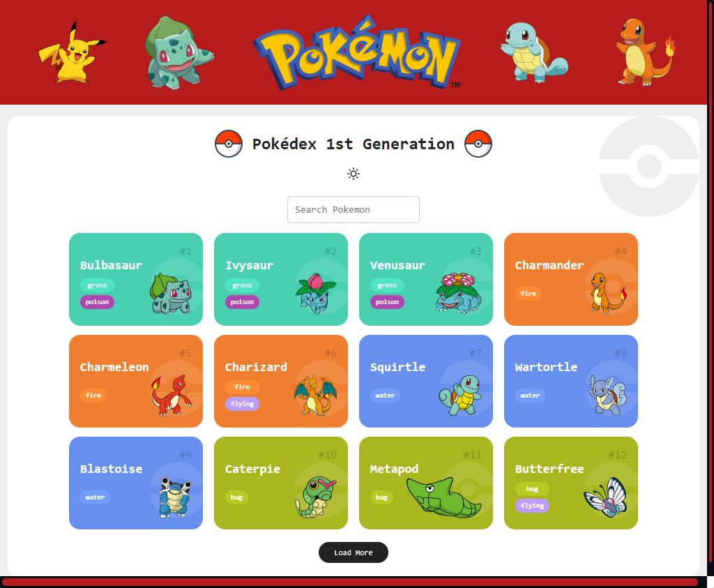
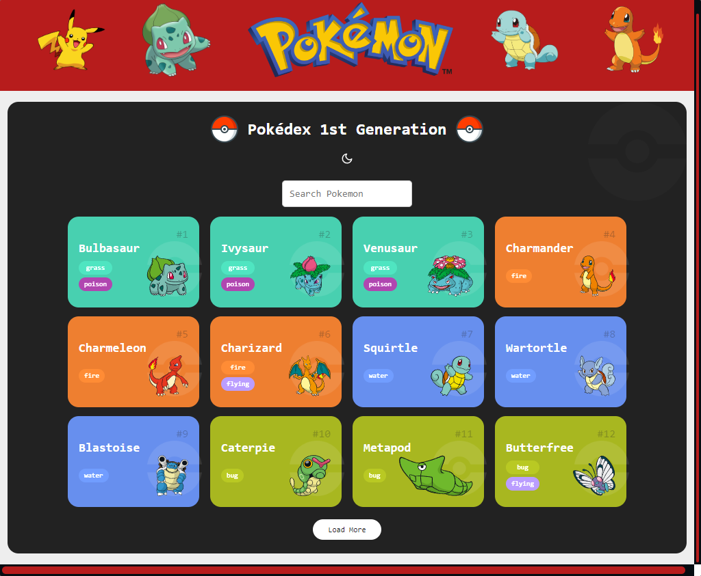
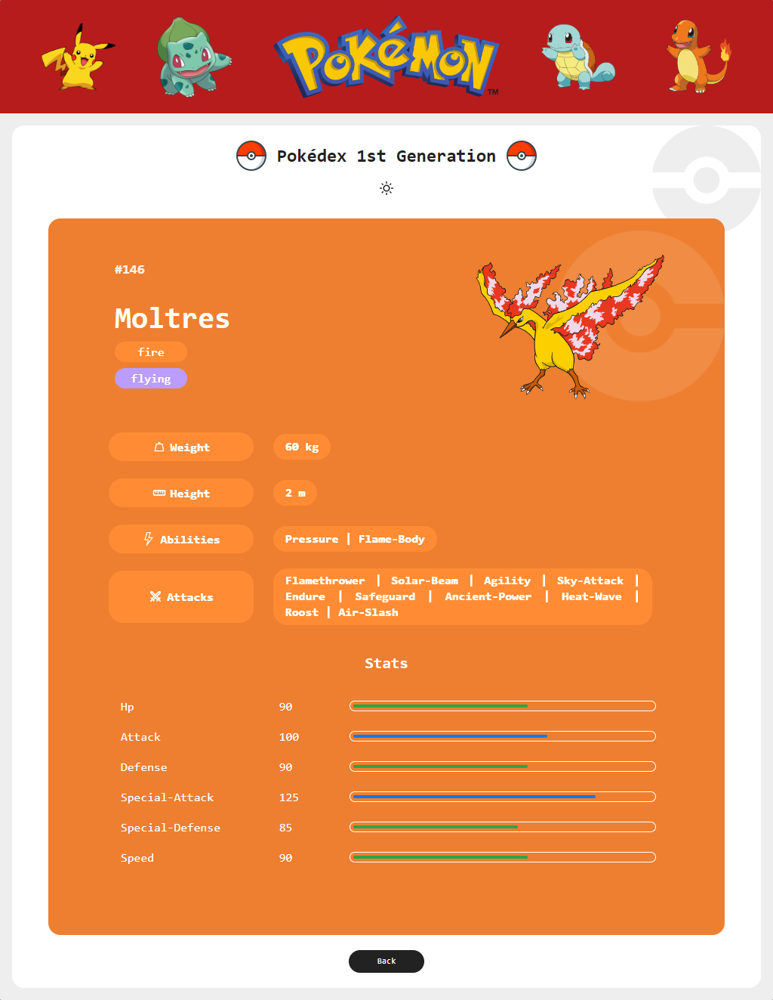
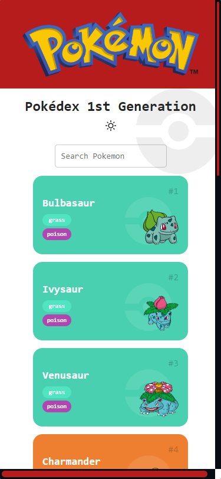
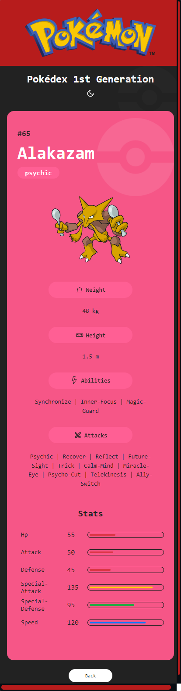

# Projeto Pokédex
> Projeto de uma Pokédex da primeira geração de Pokémons (os primeiros 151) utilizando a PokeAPI `https://pokeapi.co/`. Consiste de uma página inicial mostrando uma lista de 12 Pokémons com um botão que carrega os próximos 12 e adiciona à lista até o 151º. Há também uma página de detalhes de cada Pokémon clicado na lista. Projeto totalmente responsivo a todos os tamanhos de tela.

## Começando com Create React App

Este projeto foi inicializado com [Create React App](https://github.com/facebook/create-react-app).

## Índice
- [Scripts Disponíveis](#scripts-disponíveis)
- [Imagens do projeto](#imagem-do-projeto)
- [Repositório do projeto](#repositório-do-projeto)
- [Tecnologias 💻](#tecnologias-💻)
- [O que aprendi 👨🏻‍💻](#o-que-aprendi-👨🏻‍💻)
- [Contato 📩](#contato-📩)

## Scripts Disponíveis

No diretório do projeto, você pode executar:

### `npm start`

Executa o aplicativo no modo de desenvolvimento.\
Abra [http://localhost:3000](http://localhost:3000) para visualizá-lo em seu navegador.

A página será recarregada quando você fizer alterações.

### `npm test`

Inicia o executor de testes no modo de observação interativo.\
Consulte a seção sobre [running tests](https://facebook.github.io/create-react-app/docs/running-tests) para obter mais informações.

### `npm run build`

Cria o aplicativo para produção na pasta `build`.\
Ele agrupa corretamente o React no modo de produção e otimiza a construção para obter o melhor desempenho.

A compilação é reduzida e os nomes dos arquivos incluem os hashes.\
Seu aplicativo está pronto para ser implantado!

Consulte a seção sobre [deployment](https://facebook.github.io/create-react-app/docs/deployment) para obter mais informações.

### `npm run eject`

**Observação: esta é uma operação unidirecional. Depois de `ejetar`, você não pode voltar!**

Se você não estiver satisfeito com a ferramenta de construção e as opções de configuração, você pode `ejetar` a qualquer momento. Este comando removerá a dependência de compilação única do seu projeto.

Em vez disso, ele copiará todos os arquivos de configuração e as dependências transitivas (webpack, Babel, ESLint, etc) diretamente no seu projeto para que você tenha controle total sobre eles. Todos os comandos, exceto `eject`, ainda funcionarão, mas apontarão para os scripts copiados para que você possa ajustá-los. Neste ponto você está sozinho.

Você nunca precisa usar `eject`. O conjunto de recursos selecionados é adequado para implantações pequenas e médias e você não deve se sentir obrigado a usar esse recurso. No entanto, entendemos que esta ferramenta não seria útil se você não pudesse personalizá-la quando estiver pronto para isso.

## Imagens do Projeto

- Lista de Pokémons da Primeira Geração utilizando a PokeAPI.

- Botão com troca de tema entre claro e escuro para uma melhor visualização do usuário, utilizando Context API do React.

- Página de detalhes do Pokémon, com peso, altura, habilidades e ataques, bem como os status (Hp, Ataque, Defesa, Ataque especial, Defesa Especial e Velocidade) representados também com uma barra progressiva, onde o vermelho representa status baixo, verde é médio, azul é bom e amarelo é status ótimo.

- Exemplo da responsividade para Tablet.

- Responsividade adaptada ao tamanho de smartphone

- Página de detalhes no tamanho de Celular e com tema escuro.

## Deploy do Projeto

[🔗 Clique aqui para cessar o deploy do Projeto](https://pokedex-react-ts-peach.vercel.app/)

## Tecnologias 💻

Este projeto foi iniciado com [Create React App](https://github.com/facebook/create-react-app) e feito basicamente com React e Typescript.

- HTML
- CSS
- Javascript
- React
    - React-router-dom
    - React-icons
    - Styled-components
    - Context API
- Typescript

## O que aprendi 👨🏻‍💻

Este projeto foi bastante desafiador para mim com o uso do Typescript. Aprendi bastante a fazer as tipagens de variáveis e parâmetros de funções e percebi o quanto deixa a aplicação mais robusta, tendo em vista que o Typescript nos ajuda a detectar e corrigir erros relacionados a tipos durante o desenvolvimento antes mesmo de executar o código.

Pude aperfeiçoar o conhecimento em React, utilizando, por exemplo, o react-router-dom para fazer a paginação em SPAs. E também a utilização do styled-components, aprimorando o conhecimento em CSS escrevendo estilos como código javascript. Os components criados podem ser utilizados em qualquer parte da aplicação. Facilita também a manutenção.

Pude aprender mais na prática também o Context API do React, passando dados sem a necessidade de passar props em cada nível. Assim, pude fazer um botão com a troca de temas entre Claro e Escuro.

## Contato 📩
[alysson_leite@yahoo.com.br](alysson_leite@yahoo.com.br)

[Linkedin](https://www.linkedin.com/in/alysson-leite/)

[Github](https://github.com/alysson-leite)
